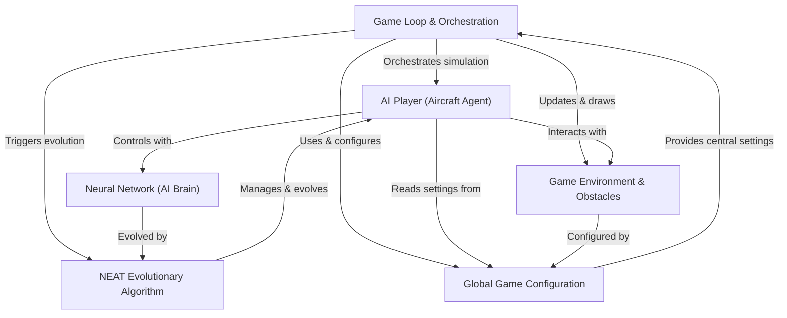
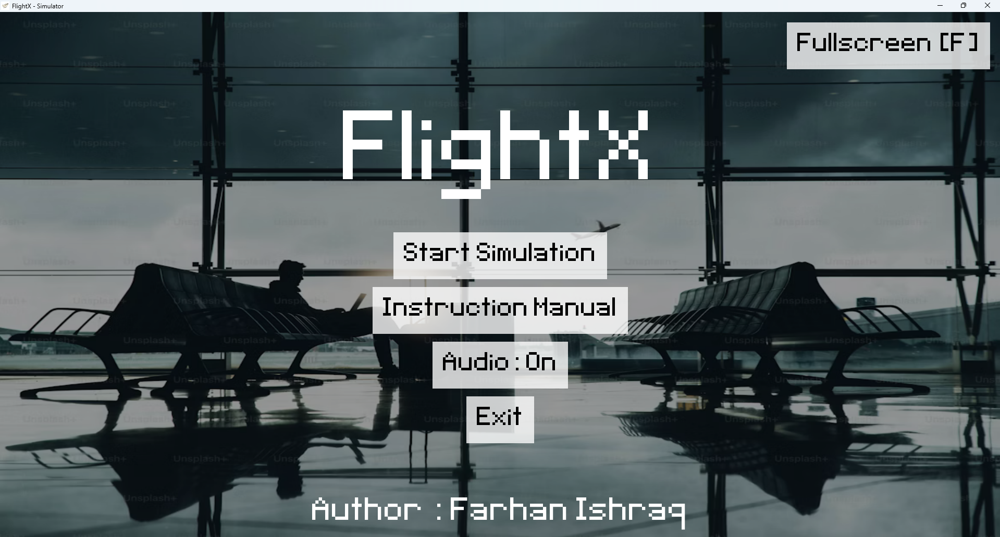
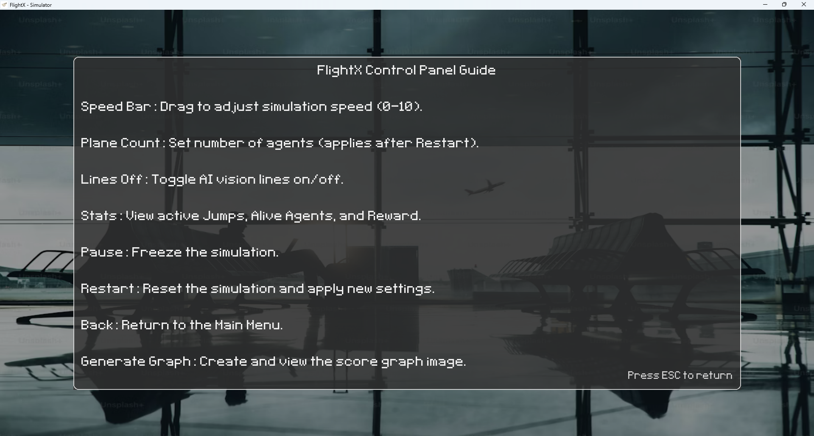
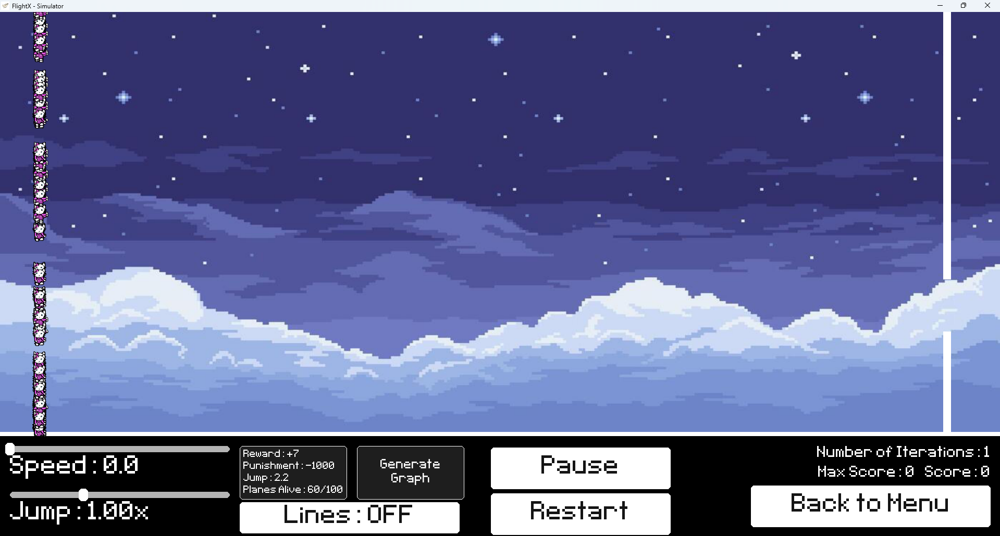
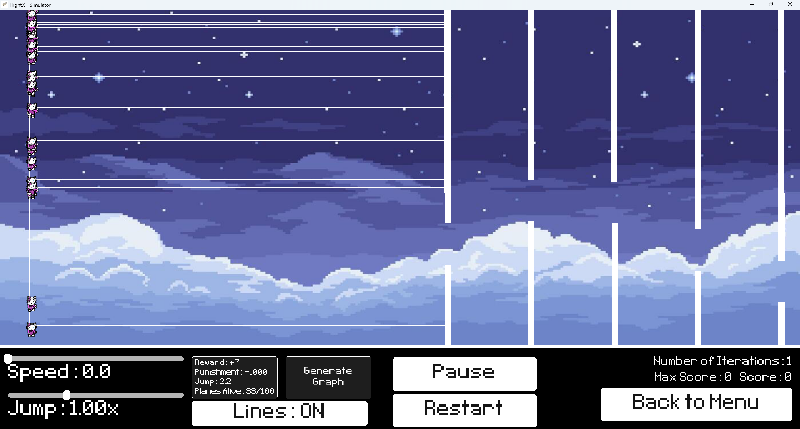
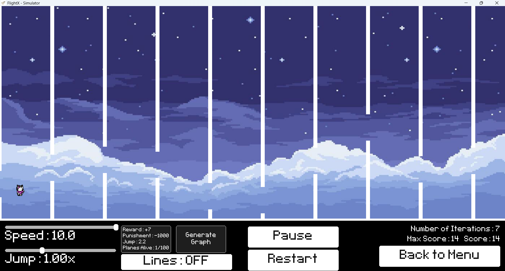

<h1 align="center">
  <span style="font-family: monospace; font-weight: bold;">
    F L I G H T - X
  </span>
</h1>

<div align="center">


  
  <table width="80%">
    <tr>
      <td style="vertical-align: top; padding-right: 20px;">
        <strong>Author:</strong><br>
        Md. Farhan Ishraq<br>
      </td>
      <td style="vertical-align: top; padding-left: 20px;">
        <strong>Supervisor:</strong><br>
        MD. ATIQUR RAHMAN<br>
        Lecturer, Dept. of CSE,<br>
        IUT
      </td>
    </tr>
  </table>
</div>

---

FlightX is an **AI simulation** where *virtual aircraft* learn to fly through a challenging environment filled with obstacles. Each aircraft is controlled by a **neural network** that acts as its "brain," making decisions based on its perception. The project uses a **NEAT evolutionary algorithm** to allow these AI players to *learn and improve* their flying skills over many generations, progressively getting smarter at navigating the game world.

This project was built as an **academic and experimental platform** to explore:
- Artificial Intelligence
- Neural computation
- Evolutionary learning
- Real-time simulation systems

<div align="center">
<pre>
╔════════════════════════════════════════════════════════════╗
║  No external machine learning or deep learning libraries   ║
║                 are used in this project.                  ║
╚════════════════════════════════════════════════════════════╝
</pre>
  
</div>

---

## 📌 Key Highlights

- Custom **Multilayer Perceptron (MLP)** implemented from first principles  
- **Evolutionary learning** (mutation, selection, speciation)  
- No backpropagation, no gradient descent, no labeled data  
- Real-time simulation using **Pygame**  
- Performance analytics and visual feedback  
- Fully modular, transparent, educational codebase  

---


## Visual Overview


---
## 🖥️ Main Menu Screenshots

<table align="center">
  <tr>
    <td align="center" valign="top">
      <br>
      <em>Main-Menu</em>
    </td>
    <td align="center" valign="top">
      <br>
      <em>Instruction Panel</em>
    </td>
  </tr>
</table>


---

## 🖥️ Simulation Screenshots

<table align="center">
  <tr>
    <td align="center" valign="top">
      <br>
      <em>Snap - 01</em>
    </td>
    <td align="center" valign="top">
      <br>
      <em>Snap - 02</em>
    </td>
    <td align="center" valign="top">
      <br>
      <em>Snap - 03</em>
    </td>
  </tr>
</table>

--- 

## 🌍 Simulation Environment

### World Representation
- Horizontally scrolling 2D world
- Procedurally generated vertical pipe obstacles
- Ground and ceiling boundaries
  
### Physics & Collision
- Gravity affects vertical velocity
- Velocity constraints apply
- Collision with pipes, ground, or ceiling terminates the agent immediately

---

## 🧍 AI Agent Design

Each agent represents an autonomous entity with:

- Physical state (position, velocity)
- Vision system
- Neural decision-maker
- Fitness evaluator

Agents operate independently but evolve collectively.

---

## 👁️ Vision System (Sensory Input)

Each agent perceives **only the nearest obstacle** using **four normalized inputs**:

<div align="center">

| Input | Description |
|-----|-------------|
| x₁ | Vertical offset from the center of the next pipe gap |
| x₂ | Horizontal distance to the nearest obstacle |
| x₃ | Reserved input (future extensibility) |
| x₄ | Current vertical velocity |

</div>

---

## 🧠 Neural Network — Multilayer Perceptron (From Scratch)

### Architecture

The neural controller is a **custom-built Multilayer Perceptron (MLP)**:

Input Layer (4 neurons)
↓
Bias Node
↓
Output Layer (1 neuron)


There are **no hidden layers**, keeping the system minimal, interpretable, and efficient.

---

### Bias Neuron

A constant bias input (`x₀ = 1`) is added to:
- Shift activation thresholds
- Prevent zero-locking
- Improve representational flexibility

---

### Activation Function

The output neuron uses a **sigmoid activation function**:

$$
\sigma(x) = \frac{1}{1 + e^{-x}}
$$

---
### Decision Logic

The neural output determines the agent’s action:

<div align="center">

| Output Value | Action |
|-------------|--------|
| > 0.55 | Upward flap |
| < 0.45 | Accelerated descent |
| Otherwise | Passive glide |

</div>

---

## 🚀 Setup & Running
#### 1️⃣ Clone the repository

```bash
git clone https://github.com/farhanishraq17/FlightX.git
cd FlightX
```
#### 2️⃣ Create a virtual environment (recommended)
```bash
python -m venv venv
venv\Scripts\activate
```
#### 3️⃣ Install dependencies
```bash
pip install -r requirements.txt
```
If pygame fails to install, run:
```bash
pip install pygame
```
#### 4️⃣ Run the simulation
```bash
python main.py
```

