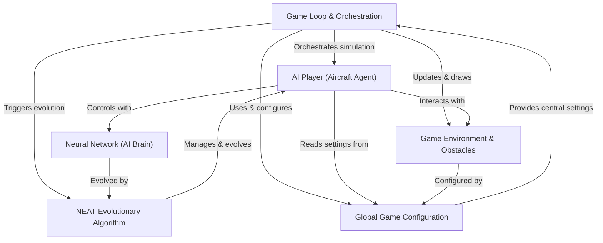

## FlightX

FlightX is an **AI simulation** where *virtual aircraft* learn to fly through a challenging environment filled with obstacles. Each aircraft is controlled by a **neural network** that acts as its "brain," making decisions based on its perception. The project uses a **NEAT evolutionary algorithm** to allow these AI players to *learn and improve* their flying skills over many generations, progressively getting smarter at navigating the game world.

## Visual Overview

## Chapters

1. [Global Game Configuration
](01_global_game_configuration_.md)
2. [Game Environment & Obstacles
](02_game_environment___obstacles_.md)
3. [AI Player (Aircraft Agent)
](03_ai_player__aircraft_agent__.md)
4. [Neural Network (AI Brain)
](04_neural_network__ai_brain__.md)
5. [NEAT Evolutionary Algorithm
](05_neat_evolutionary_algorithm_.md)
6. [Game Loop & Orchestration
](06_game_loop___orchestration_.md)

---
