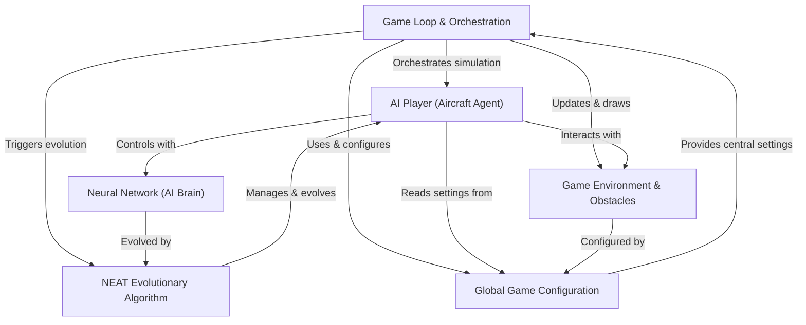
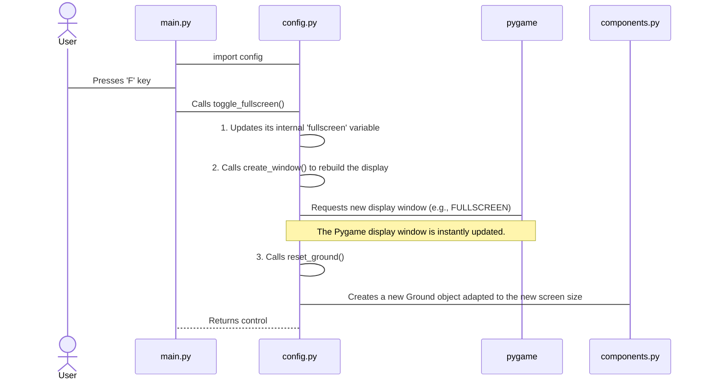

## FlightX

FlightX is an **AI simulation** where *virtual aircraft* learn to fly through a challenging environment filled with obstacles. Each aircraft is controlled by a **neural network** that acts as its "brain," making decisions based on its perception. The project uses a **NEAT evolutionary algorithm** to allow these AI players to *learn and improve* their flying skills over many generations, progressively getting smarter at navigating the game world.


## Visual Overview



## Chapters

1. [Global Game Configuration
](01_global_game_configuration_.md)
2. [Game Environment & Obstacles
](02_game_environment___obstacles_.md)
3. [AI Player (Aircraft Agent)
](03_ai_player__aircraft_agent__.md)
4. [Neural Network (AI Brain)
](04_neural_network__ai_brain__.md)
5. [NEAT Evolutionary Algorithm
](05_neat_evolutionary_algorithm_.md)
6. [Game Loop & Orchestration
](06_game_loop___orchestration_.md)

---

# Chapter 1: Global Game Configuration

Welcome to the world of FlightX! In this tutorial, we'll explore how our AI aircraft learns to fly. But before we get to the exciting AI parts, every good project needs a solid foundation. Imagine building a house – you need a blueprint that defines the size of the rooms, where the plumbing goes, and if there's a garden. In game development, we need something similar: a central place for all our important game rules and shared items. This is precisely what **Global Game Configuration** is for!

## What is Global Game Configuration?

Think of Global Game Configuration as the **control panel** or the **"global settings" file** for your entire FlightX application. It's a special module where we keep track of settings that affect the whole game, like:

*   **Screen size:** How wide and tall should our game window be?
*   **Fullscreen mode:** Should the game take up the whole screen?
*   **Audio:** Is the music on or off?
*   **Simulation speed:** How fast should our AI simulation run?

Besides settings, it also holds references to important shared game objects, meaning common items that many parts of the game need to use. For example, the actual Pygame display window itself, the ground the aircraft flies over, and the list of pipes the aircraft has to avoid.

### Why Do We Need It?

Let's consider a practical problem: **changing the game's screen size or toggling fullscreen.**

Without a central configuration, imagine if every part of your game that draws something to the screen had its own idea of the screen size. If you wanted to change the screen from 800x600 to 1280x720, you'd have to go through countless files, find every mention of screen width and height, and update them. That's a lot of work and very prone to errors!

With a Global Game Configuration, you change the screen size in *one place*, and every other part of the game automatically uses this updated information. It's much cleaner and easier to manage.

## How to Use Global Configuration

In FlightX, we have a dedicated file called `config.py` that serves as our global configuration hub. Any other file in our project that needs a global setting or a shared object simply `import`s `config` and then uses `config.` followed by the setting's name.

### Accessing Settings

Let's say you want to know the current window width. You just access it like this:

```python
# In main.py or any other file
import config

# Get the current window width
current_width = config.win_width
print(f"The game window width is: {current_width} pixels")

# Get the current fullscreen status
is_fullscreen = config.fullscreen
print(f"Is fullscreen mode active? {is_fullscreen}")
```
This code snippet would output something like:
```
The game window width is: 900 pixels
Is fullscreen mode active? False
```
This shows how easy it is to read any global setting from anywhere in the project.

### Changing Settings (e.g., Fullscreen Mode)

Many global settings are simply variables that can be changed. However, some settings, like fullscreen mode or screen size, require the game to react immediately. The `config.py` module also provides special functions for these actions.

Let's see how `main.py` can toggle fullscreen mode when you press the 'F' key:

```python
# In main.py (simplified event handling)
import config
import pygame

# ... (pygame initialization and other setup) ...

# Imagine this is inside your main game loop
def handle_common_events(event):
    if event.type == pygame.KEYDOWN:
        if event.key == pygame.K_f:
            print(f"Before toggle: Fullscreen = {config.fullscreen}")
            config.toggle_fullscreen() # Call the config module's function
            print(f"After toggle: Fullscreen = {config.fullscreen}")
            # The game window will immediately change!

# Simulating an 'F' key press
class MockEvent:
    type = pygame.KEYDOWN
    key = pygame.K_f

# Call the handler with a mock event
handle_common_events(MockEvent())
```
When this code runs and the 'F' key is "pressed", you'd see output like:
```
Before toggle: Fullscreen = False
After toggle: Fullscreen = True
```
More importantly, the game window itself would instantly switch to or from fullscreen mode! This happens because the `toggle_fullscreen()` function in `config.py` handles the actual Pygame window update.

## Under the Hood: Inside `config.py`

Let's peek into the `config.py` file to understand how it works.

### High-Level Walkthrough

When you ask the `config` module to toggle fullscreen, here's what happens:



### The Code in `config.py`

The `config.py` file is straightforward. It starts by defining a bunch of variables that hold our global settings and placeholders for shared game objects.

```python
# File: config.py
import pygame
import components # We need this to create game objects like Ground

# --- Global Settings (Variables) ---
win_height = 720  # Default window height in pixels
win_width = 900   # Default window width in pixels
window = None     # This will hold the actual Pygame display window later
fullscreen = False # True if the game is in fullscreen mode
mute = False      # True if all game audio should be off
show_lines = False # True if AI vision lines should be drawn (for debugging)
jump_scale = 1.0  # A multiplier for the player's jump strength

# --- Shared Game Objects (Placeholders) ---
ground = None     # This will hold the game's 'Ground' object
pipes = []        # This list will store all the 'Pipes' (obstacles) in the game
```
Here, `win_height`, `win_width`, `fullscreen`, `mute`, `show_lines`, and `jump_scale` are our core settings. `window`, `ground`, and `pipes` are placeholders that will later hold actual game objects. Notice that `window` is `None` initially because the Pygame window isn't created until the game starts.

Next, `config.py` defines functions to manage these settings and objects:

```python
# File: config.py (continued)

def create_window():
    global window # We need 'global' to change the 'window' variable
    flags = pygame.RESIZABLE # Allow the window to be resized
    if fullscreen:
        flags |= pygame.FULLSCREEN # Add fullscreen flag if it's enabled
    # Create the Pygame display window with current width, height, and flags
    window = pygame.display.set_mode((win_width, win_height), flags)
    return window

def toggle_fullscreen():
    global fullscreen # We need 'global' to change the 'fullscreen' variable
    fullscreen = not fullscreen # Flip the fullscreen status (True becomes False, and vice-versa)
    create_window() # Recreate the Pygame window with the new fullscreen setting
    reset_ground()  # The ground object needs to be recreated if the screen size changes
```
The `create_window()` function is crucial. It uses the `global` keyword to tell Python that it's modifying the `window` variable *outside* of this function, not creating a new local one. It then uses Pygame to create the display.

`toggle_fullscreen()` also uses `global` to change the `fullscreen` setting. After flipping the setting, it calls `create_window()` to apply the change and `reset_ground()` because the ground's position depends on the window's height.

```python
# File: config.py (continued)

def resize(width, height):
    global win_width, win_height # Declare these as global to modify them
    win_width = max(480, width)  # Update width, ensuring it's at least 480 pixels
    win_height = max(360, height) # Update height, ensuring it's at least 360 pixels
    create_window() # Recreate the Pygame window with the new dimensions
    reset_ground()  # Recreate the ground to fit the new height
```
The `resize()` function allows us to change the window's dimensions dynamically, again calling `create_window()` and `reset_ground()` to update everything.

```python
# File: config.py (continued)

def reset_ground():
    global ground # Declare 'ground' as global to modify it
    # Create a new Ground object using the current global window dimensions
    # The Ground object is defined in components.py (we'll see it later!)
    ground = components.Ground(win_width, win_height)
```
Finally, `reset_ground()` ensures that our `ground` object always matches the current screen dimensions. It uses the `Ground` class from our `components.py` file to create a new ground object. This demonstrates how global objects (like `ground`) are managed and updated through our configuration.

### Benefits of This Approach

Using a `config.py` for global settings and shared objects offers many advantages:

| Benefit                      | Description                                                  |
| :--------------------------- | :----------------------------------------------------------- |
| **Easy Access**              | Any module can simply `import config` and use `config.setting_name`. |
| **Single Source of Truth**   | A setting like `win_width` is defined only once, preventing confusion and errors. |
| **Central Control**          | Changes to core game behavior (e.g., resolution, audio) can be made in one place. |
| **Shared Resources**         | Important game objects (like the `window` or `ground`) are readily available to all parts of the game that need them. |
| **Modularity & Organization**| Keeps global variables separate from game logic, making the code cleaner. |

## Conclusion

The `config.py` module is our project's command center for global settings and shared resources. By understanding how to access and modify these settings, and how functions like `create_window()` and `toggle_fullscreen()` work, you've taken a crucial first step in understanding the FlightX project. This central hub makes our game much easier to manage and modify.

Now that we know how to set up the basic game parameters, let's dive into creating the actual game world our AI aircraft will interact with.

[Next Chapter: Game Environment & Obstacles](02_game_environment___obstacles_.md)

---

<sup>**References**: [[1]](https://github.com/farhanishraq17/FlightX/blob/246bd74ecb5dcad14aa1bc3bfb89dac36b241520/components.py), [[2]](https://github.com/farhanishraq17/FlightX/blob/246bd74ecb5dcad14aa1bc3bfb89dac36b241520/config.py), [[3]](https://github.com/farhanishraq17/FlightX/blob/246bd74ecb5dcad14aa1bc3bfb89dac36b241520/main.py), [[4]](https://github.com/farhanishraq17/FlightX/blob/246bd74ecb5dcad14aa1bc3bfb89dac36b241520/player.py)</sup></sub>
