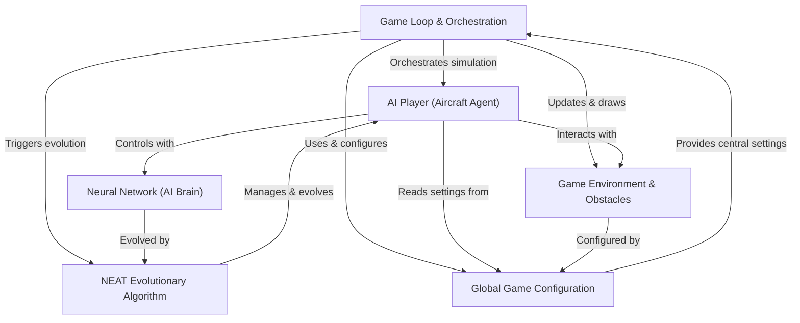
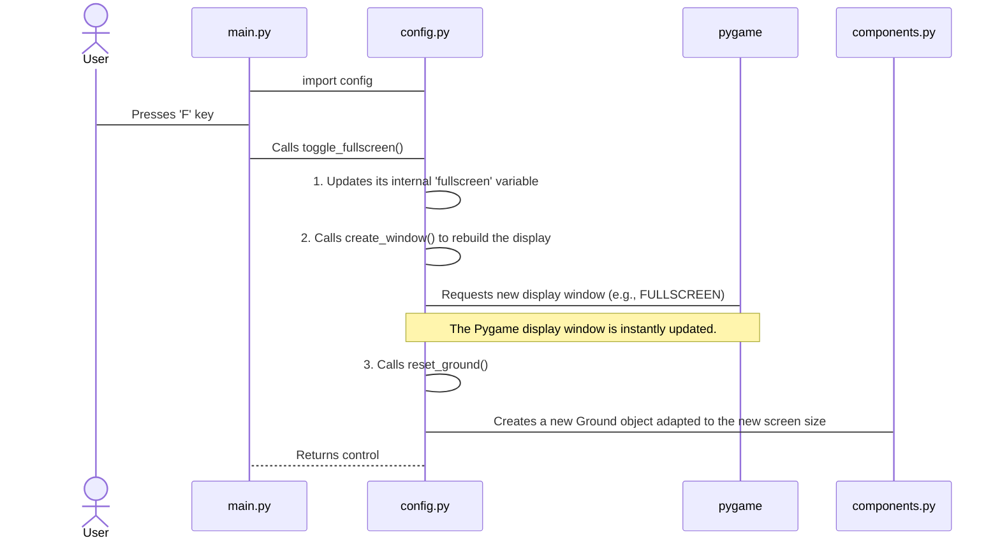
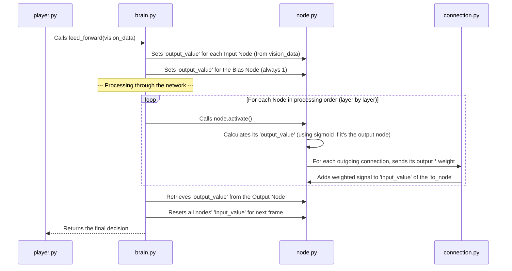
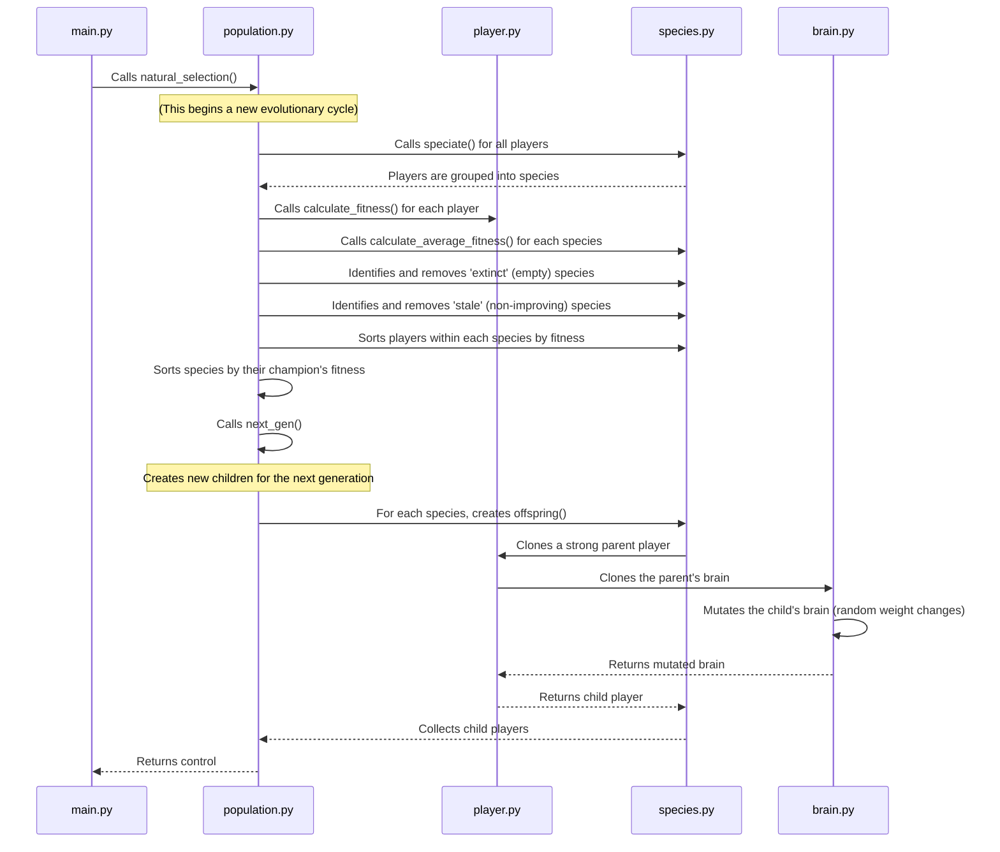
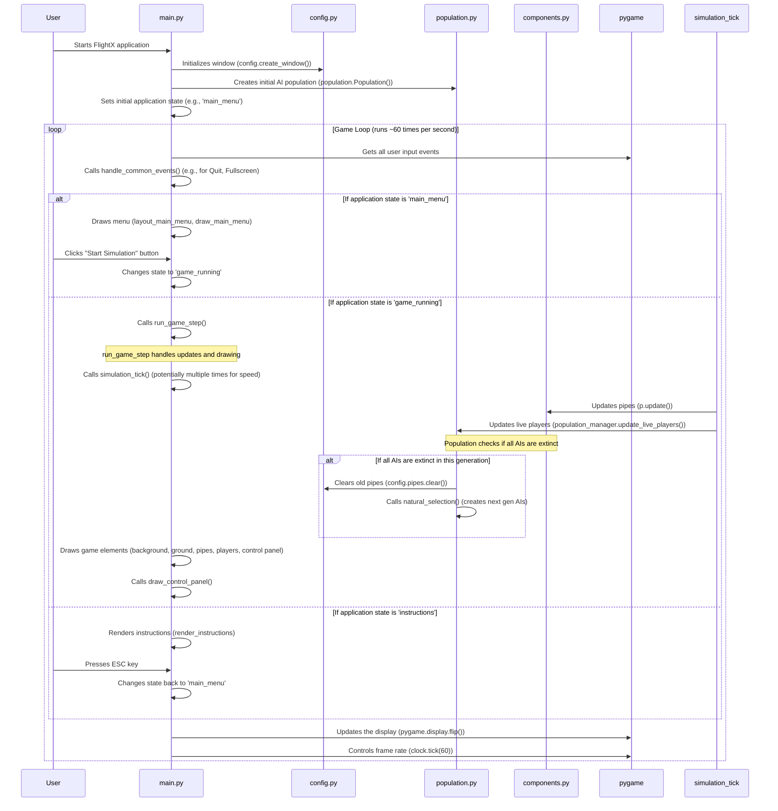

## FlightX

FlightX is an **AI simulation** where *virtual aircraft* learn to fly through a challenging environment filled with obstacles. Each aircraft is controlled by a **neural network** that acts as its "brain," making decisions based on its perception. The project uses a **NEAT evolutionary algorithm** to allow these AI players to *learn and improve* their flying skills over many generations, progressively getting smarter at navigating the game world.


## Visual Overview



## Chapters

1. [Global Game Configuration
](01_global_game_configuration_.md)
2. [Game Environment & Obstacles
](02_game_environment___obstacles_.md)
3. [AI Player (Aircraft Agent)
](03_ai_player__aircraft_agent__.md)
4. [Neural Network (AI Brain)
](04_neural_network__ai_brain__.md)
5. [NEAT Evolutionary Algorithm
](05_neat_evolutionary_algorithm_.md)
6. [Game Loop & Orchestration
](06_game_loop___orchestration_.md)

---

# Chapter 1: Global Game Configuration

Welcome to the world of FlightX! In this tutorial, we'll explore how our AI aircraft learns to fly. But before we get to the exciting AI parts, every good project needs a solid foundation. Imagine building a house – you need a blueprint that defines the size of the rooms, where the plumbing goes, and if there's a garden. In game development, we need something similar: a central place for all our important game rules and shared items. This is precisely what **Global Game Configuration** is for!

## What is Global Game Configuration?

Think of Global Game Configuration as the **control panel** or the **"global settings" file** for your entire FlightX application. It's a special module where we keep track of settings that affect the whole game, like:

*   **Screen size:** How wide and tall should our game window be?
*   **Fullscreen mode:** Should the game take up the whole screen?
*   **Audio:** Is the music on or off?
*   **Simulation speed:** How fast should our AI simulation run?

Besides settings, it also holds references to important shared game objects, meaning common items that many parts of the game need to use. For example, the actual Pygame display window itself, the ground the aircraft flies over, and the list of pipes the aircraft has to avoid.

### Why Do We Need It?

Let's consider a practical problem: **changing the game's screen size or toggling fullscreen.**

Without a central configuration, imagine if every part of your game that draws something to the screen had its own idea of the screen size. If you wanted to change the screen from 800x600 to 1280x720, you'd have to go through countless files, find every mention of screen width and height, and update them. That's a lot of work and very prone to errors!

With a Global Game Configuration, you change the screen size in *one place*, and every other part of the game automatically uses this updated information. It's much cleaner and easier to manage.

## How to Use Global Configuration

In FlightX, we have a dedicated file called `config.py` that serves as our global configuration hub. Any other file in our project that needs a global setting or a shared object simply `import`s `config` and then uses `config.` followed by the setting's name.

### Accessing Settings

Let's say you want to know the current window width. You just access it like this:

```python
# In main.py or any other file
import config

# Get the current window width
current_width = config.win_width
print(f"The game window width is: {current_width} pixels")

# Get the current fullscreen status
is_fullscreen = config.fullscreen
print(f"Is fullscreen mode active? {is_fullscreen}")
```
This code snippet would output something like:
```
The game window width is: 900 pixels
Is fullscreen mode active? False
```
This shows how easy it is to read any global setting from anywhere in the project.

### Changing Settings (e.g., Fullscreen Mode)

Many global settings are simply variables that can be changed. However, some settings, like fullscreen mode or screen size, require the game to react immediately. The `config.py` module also provides special functions for these actions.

Let's see how `main.py` can toggle fullscreen mode when you press the 'F' key:

```python
# In main.py (simplified event handling)
import config
import pygame

# ... (pygame initialization and other setup) ...

# Imagine this is inside your main game loop
def handle_common_events(event):
    if event.type == pygame.KEYDOWN:
        if event.key == pygame.K_f:
            print(f"Before toggle: Fullscreen = {config.fullscreen}")
            config.toggle_fullscreen() # Call the config module's function
            print(f"After toggle: Fullscreen = {config.fullscreen}")
            # The game window will immediately change!

# Simulating an 'F' key press
class MockEvent:
    type = pygame.KEYDOWN
    key = pygame.K_f

# Call the handler with a mock event
handle_common_events(MockEvent())
```
When this code runs and the 'F' key is "pressed", you'd see output like:
```
Before toggle: Fullscreen = False
After toggle: Fullscreen = True
```
More importantly, the game window itself would instantly switch to or from fullscreen mode! This happens because the `toggle_fullscreen()` function in `config.py` handles the actual Pygame window update.

## Under the Hood: Inside `config.py`

Let's peek into the `config.py` file to understand how it works.

### High-Level Walkthrough

When you ask the `config` module to toggle fullscreen, here's what happens:



### The Code in `config.py`

The `config.py` file is straightforward. It starts by defining a bunch of variables that hold our global settings and placeholders for shared game objects.

```python
# File: config.py
import pygame
import components # We need this to create game objects like Ground

# --- Global Settings (Variables) ---
win_height = 720  # Default window height in pixels
win_width = 900   # Default window width in pixels
window = None     # This will hold the actual Pygame display window later
fullscreen = False # True if the game is in fullscreen mode
mute = False      # True if all game audio should be off
show_lines = False # True if AI vision lines should be drawn (for debugging)
jump_scale = 1.0  # A multiplier for the player's jump strength

# --- Shared Game Objects (Placeholders) ---
ground = None     # This will hold the game's 'Ground' object
pipes = []        # This list will store all the 'Pipes' (obstacles) in the game
```
Here, `win_height`, `win_width`, `fullscreen`, `mute`, `show_lines`, and `jump_scale` are our core settings. `window`, `ground`, and `pipes` are placeholders that will later hold actual game objects. Notice that `window` is `None` initially because the Pygame window isn't created until the game starts.

Next, `config.py` defines functions to manage these settings and objects:

```python
# File: config.py (continued)

def create_window():
    global window # We need 'global' to change the 'window' variable
    flags = pygame.RESIZABLE # Allow the window to be resized
    if fullscreen:
        flags |= pygame.FULLSCREEN # Add fullscreen flag if it's enabled
    # Create the Pygame display window with current width, height, and flags
    window = pygame.display.set_mode((win_width, win_height), flags)
    return window

def toggle_fullscreen():
    global fullscreen # We need 'global' to change the 'fullscreen' variable
    fullscreen = not fullscreen # Flip the fullscreen status (True becomes False, and vice-versa)
    create_window() # Recreate the Pygame window with the new fullscreen setting
    reset_ground()  # The ground object needs to be recreated if the screen size changes
```
The `create_window()` function is crucial. It uses the `global` keyword to tell Python that it's modifying the `window` variable *outside* of this function, not creating a new local one. It then uses Pygame to create the display.

`toggle_fullscreen()` also uses `global` to change the `fullscreen` setting. After flipping the setting, it calls `create_window()` to apply the change and `reset_ground()` because the ground's position depends on the window's height.

```python
# File: config.py (continued)

def resize(width, height):
    global win_width, win_height # Declare these as global to modify them
    win_width = max(480, width)  # Update width, ensuring it's at least 480 pixels
    win_height = max(360, height) # Update height, ensuring it's at least 360 pixels
    create_window() # Recreate the Pygame window with the new dimensions
    reset_ground()  # Recreate the ground to fit the new height
```
The `resize()` function allows us to change the window's dimensions dynamically, again calling `create_window()` and `reset_ground()` to update everything.

```python
# File: config.py (continued)

def reset_ground():
    global ground # Declare 'ground' as global to modify it
    # Create a new Ground object using the current global window dimensions
    # The Ground object is defined in components.py (we'll see it later!)
    ground = components.Ground(win_width, win_height)
```
Finally, `reset_ground()` ensures that our `ground` object always matches the current screen dimensions. It uses the `Ground` class from our `components.py` file to create a new ground object. This demonstrates how global objects (like `ground`) are managed and updated through our configuration.

### Benefits of This Approach

Using a `config.py` for global settings and shared objects offers many advantages:

| Benefit                      | Description                                                  |
| :--------------------------- | :----------------------------------------------------------- |
| **Easy Access**              | Any module can simply `import config` and use `config.setting_name`. |
| **Single Source of Truth**   | A setting like `win_width` is defined only once, preventing confusion and errors. |
| **Central Control**          | Changes to core game behavior (e.g., resolution, audio) can be made in one place. |
| **Shared Resources**         | Important game objects (like the `window` or `ground`) are readily available to all parts of the game that need them. |
| **Modularity & Organization**| Keeps global variables separate from game logic, making the code cleaner. |

---

# Chapter 2: Game Environment & Obstacles

Welcome back, FlightX enthusiast! In [Chapter 1: Global Game Configuration](01_global_game_configuration_.md), we learned about setting up the fundamental rules and shared resources for our game, like screen dimensions and whether the game is in fullscreen. With our game's "blueprint" ready, it's time to actually build the world our AI aircraft will fly through.

Imagine preparing for an obstacle race. You need to know the starting line, the solid ground you run on, and what obstacles you'll encounter along the way. In FlightX, this is exactly what the **Game Environment & Obstacles** concept is all about!

## What are Game Environment & Obstacles?

These are the physical parts of our game world that create the challenges and boundaries for our AI aircraft. They're like the course itself in our obstacle race. In FlightX, we specifically focus on two main elements:

1.  **The Ground:** This is the solid surface at the bottom of the screen. If our aircraft touches it, that's a collision! It sets a clear lower boundary for the flight.
2.  **Pipes:** These are the moving obstacles that the aircraft must navigate through without touching. They come in pairs (a top pipe and a bottom pipe) with a gap in between, acting like gates the aircraft must fly through.

These elements aren't static; their positions and properties (like pipe height) are constantly updated as the game progresses, making the simulation dynamic and challenging.

## Why Do We Need Them?

Without a defined environment and obstacles, our AI aircraft would just fly endlessly in an empty space – which isn't much of a game or a challenge! These components serve several crucial purposes:

*   **Provide a Play Area:** The ground defines the lower limit of the flight zone.
*   **Create Challenges:** Pipes introduce the core obstacle-avoidance task, which is what our AI will learn to master.
*   **Enable Interaction:** They allow for collisions (with ground or pipes) that signal failure, and successful navigation (through pipes) that signals progress and rewards the AI.
*   **Visualize the World:** They give us, the players, a visual representation of the AI's performance and the simulation's progress.

Let's look at how we create and manage these vital parts of our game.

## How We Use Environment & Obstacles

In FlightX, we have special Python classes defined in `components.py` for `Ground` and `Pipes`. These classes act like blueprints for creating individual ground and pipe objects. The `main.py` file then uses these blueprints to build and manage the game world.

### Creating the Ground

The `Ground` object is created once when the game starts or when the window size changes. It uses the `win_width` and `win_height` settings from our [Global Game Configuration](01_global_game_configuration_.md) to determine its size and position.

```python
# In main.py (simplified setup)
import config
import components

# ... (pygame initialization and other setup) ...

# 1. First, create the window (as seen in Chapter 1)
config.create_window()

# 2. Then, create the ground object
config.reset_ground() # This function internally creates a Ground object

# The 'ground' object is now available globally via config.ground
print(f"Ground level set at Y-coordinate: {components.Ground.ground_level}")
```
This snippet would output something like `Ground level set at Y-coordinate: 576` (if `win_height` is 720, because `Ground.ground_level` is 80% of `win_height`).
The `config.reset_ground()` function is handy because it automatically ensures the ground object is created correctly for the current window size and stores it in `config.ground` for easy access.

### Generating and Managing Pipes

Unlike the `Ground`, `Pipes` are generated continuously throughout the game. They move from the right side of the screen to the left.

```python
# In main.py (simplified game loop actions)
import config
import components

# ... (initialization) ...

# To create a new pipe:
def generate_pipes():
    # Creates a new Pipes object and adds it to the global list
    config.pipes.append(components.Pipes(config.win_width))

# Imagine this happens periodically in the game loop
# For example, every 200 frames, a new pipe appears
if game_state['pipes_spawn_time'] <= 0: # game_state is a dictionary in main.py
    generate_pipes()
    game_state['pipes_spawn_time'] = 200 # Reset timer

# To update and draw all active pipes each frame:
for p in list(config.pipes): # Iterate through pipes stored in config
    p.update() # Move the pipe and check if it's off-screen
    p.draw(config.window) # Draw the pipe on the screen
```
In `main.py`, the `generate_pipes()` function creates a new `Pipes` object and adds it to `config.pipes`, which is a list of all active pipes. In every frame of the game, we then loop through this `config.pipes` list, telling each pipe to `update()` itself (move, check status) and `draw()` itself on the screen.

### Drawing the Entire Environment

Finally, in each frame of our game, we need to draw both the ground and all the pipes to make them visible.

```python
# In main.py (inside the main game rendering part)
import config

# ... (other drawing like background) ...

# Draw the ground
config.ground.draw(config.window)

# Draw all the pipes that are currently in the game
for pipe in config.pipes:
    pipe.draw(config.window)
```
The `draw()` method for both `Ground` and `Pipes` takes the `config.window` (our Pygame display surface) as an argument, so they know where to draw themselves.

## Under the Hood: Inside `components.py`

Let's peek into the `components.py` file, where the blueprints for our `Ground` and `Pipes` are defined.

### High-Level Walkthrough: Managing Pipes

When a new pipe is added to the game, and then continuously updated and drawn, here's the basic flow:

sequenceDiagram
    participant MainGame as main.py
    participant Configuration as config.py
    participant GameComponents as components.py

    MainGame->>MainGame: Check if it's time to spawn a new pipe
    MainGame->>GameComponents: Create Pipes object (Pipes(config.win_width))
    GameComponents-->>MainGame: Return new Pipes (random height, off-screen right)
    MainGame->>Configuration: Append pipe to config.pipes

    Note over MainGame: Executed every game frame

    MainGame->>Configuration: Retrieve all active pipes

This diagram shows how `main.py` orchestrates the creation of a `Pipes` object using `components.py`, stores it in `config.py`, and then in every game frame, tells each pipe to update its state and draw itself.

### The `Ground` Class

The `Ground` class is quite simple. It represents the solid surface at the bottom of the screen.

```python
# File: components.py
import pygame

class Ground:
    ground_level = 500 # A default value, will be updated

    def __init__(self, win_width, win_height):
        # Calculate the ground's Y position (80% from top of the window)
        Ground.ground_level = int(win_height * 0.8)
        self.x, self.y = 0, Ground.ground_level
        # Create a Pygame rectangle for drawing and collision detection
        self.rect = pygame.Rect(self.x, self.y, win_width, 8) # 8 pixels tall

    def draw(self, window):
        # Draw a white rectangle representing the ground on the window
        pygame.draw.rect(window, (255, 255, 255), self.rect)
```
-   **`ground_level`**: This is a *class variable*, meaning it's shared by all `Ground` objects (though we only have one). It stores the Y-coordinate where the ground begins, calculated as 80% of the window's height.
-   **`__init__(self, win_width, win_height)`**: This is called when a new `Ground` object is created. It takes the window's width and height to calculate its own position and size, then creates a `pygame.Rect` object. This `rect` (rectangle) is essential for both drawing and later, detecting collisions.
-   **`draw(self, window)`**: This method takes the `window` (our Pygame display) and draws a white rectangle based on `self.rect`.

### The `Pipes` Class

The `Pipes` class is a bit more complex as it represents moving obstacles. Each `Pipes` object is actually a pair of top and bottom obstacles with an opening in between.

```python
# File: components.py
import pygame
import random

class Pipes:
    width = 15     # Width of each pipe segment in pixels
    opening = 100  # Vertical gap between the top and bottom pipes

    def __init__(self, win_width):
        self.x = win_width # Start position: right edge of the screen
        # Randomly determine bottom pipe's height
        self.bottom_height = random.randint(10, 300)
        # Calculate top pipe's height based on ground level, bottom pipe, and opening
        self.top_height = Ground.ground_level - self.bottom_height - self.opening
        # Placeholders for Pygame rectangles (will be updated in draw)
        self.bottom_rect, self.top_rect = pygame.Rect(0, 0, 0, 0), pygame.Rect(0, 0, 0, 0)
        self.passed = False    # True once the aircraft has successfully passed it
        self.counted = False   # True once this pipe has contributed to the score
        self.off_screen = False # True once the pipe has moved completely off-screen

    def draw(self, window):
        # Create/update the bottom pipe's rectangle for drawing
        self.bottom_rect = pygame.Rect(self.x, Ground.ground_level - self.bottom_height,
                                       self.width, self.bottom_height)
        pygame.draw.rect(window, (255, 255, 255), self.bottom_rect) # Draw it

        # Create/update the top pipe's rectangle for drawing
        self.top_rect = pygame.Rect(self.x, 0, self.width, self.top_height)
        pygame.draw.rect(window, (255, 255, 255), self.top_rect) # Draw it

    def update(self):
        self.x -= 1 # Move the pipe 1 pixel to the left each frame
        if self.x + self.width <= 50:
            self.passed = True # Mark as passed if its right edge is past X=50
        if self.x <= -self.width:
            self.off_screen = True # Mark for removal if completely off-screen left
```
-   **`width` and `opening`**: These are class variables defining the fixed dimensions of the pipes and the gap between them.
-   **`__init__(self, win_width)`**: When a new `Pipes` object is created, it's placed at `win_width` (the far right of the screen). It then randomly calculates the height of the bottom pipe and, from that, determines the top pipe's height, ensuring a consistent `opening`. It also sets up flags like `passed`, `counted`, and `off_screen` to track its state during the game.
-   **`draw(self, window)`**: This method calculates the precise positions and sizes of the top and bottom pipe rectangles based on the current `self.x` and draws them as white rectangles on the screen.
-   **`update(self)`**: This is called every game frame. It moves the pipe to the left by decreasing `self.x`. It also checks if the pipe has `passed` the "scoring line" (usually an X-coordinate near the left side) and if it's `off_screen` entirely, meaning it can be removed from the game.

## Benefits of This Design

Structuring our game environment as classes offers several advantages:

| Benefit                     | Description                                                  |
| :-------------------------- | :----------------------------------------------------------- |
| **Encapsulation**           | Each `Ground` or `Pipes` object manages its own data (position, size) and behavior (how to draw, how to move). |
| **Reusability**             | We can easily create many `Pipes` objects, each behaving independently, using the same `Pipes` blueprint. |
| **Modularity**              | Game world elements are separated into their own file (`components.py`), making the project easier to understand and maintain. |
| **Dynamic Behavior**        | Objects like `Pipes` can be created, updated, and removed dynamically during gameplay, making the game interactive. |
| **Clear Interaction**       | `main.py` clearly tells objects to `update()` and `draw()`, rather than managing all their internal details itself. |

---

# Chapter 3: AI Player (Aircraft Agent)

Welcome back to FlightX! In [Chapter 1: Global Game Configuration](01_global_game_configuration_.md), we laid the groundwork for our game, defining essential settings. Then, in [Chapter 2: Game Environment & Obstacles](02_game_environment___obstacles_.md), we built the world itself, introducing the `Ground` and the challenging `Pipes`. Now, it's time to introduce the star of our show: the **AI Player**, which we also call an **Aircraft Agent**.

Imagine we have a challenging obstacle course (our pipes) and we want to train someone to fly through it. We need a competitor, a pilot, something that can physically exist in the world, move around, and *learn* how to navigate. This "someone" in FlightX is our `Player` object.

## What is an AI Player (Aircraft Agent)?

Think of an `AI Player` as a single, individual aircraft flying in our simulation. It's like one bird trying to make its way through a series of obstacles. Each `Player` object is a self-contained unit that has:

1.  **Physical Properties:** It knows its own position (where it is on the screen), its velocity (how fast it's moving up or down), and whether it's currently alive or crashed.
2.  **Game Logic:** It knows *how* to move (flap its wings, or drop), how to check if it's hitting something (collision detection with the ground or pipes), and how to update its position based on gravity and its actions.
3.  **A "Brain":** This is the most exciting part! Each `Player` has its own unique "brain," which is a special kind of computer program called a [Neural Network](04_neural_network__ai_brain__.md). This brain takes in information about the environment (like how far away the next pipe is) and decides what action the aircraft should take (flap or drop).

The primary goal of each `Player` is simple: **survive as long as possible** by flying through as many pipes as it can without colliding with anything.

## Why Do We Need Individual Players?

If we want to "evolve" the best flying AI, we can't just have one aircraft. We need a whole group, or a "population," of aircraft, all trying different strategies. Each `Player` represents one attempt, one trial, one "individual" in this evolutionary process. By having many `Player` objects, we can see which ones perform better and use their "brains" to create even better ones in the next generation.

## How We Use the AI Player

In FlightX, the `Player` is defined as a Python class in `player.py`. The game's main loop (or, more precisely, the `Population` manager, which we'll cover in [Chapter 5: NEAT Evolutionary Algorithm](05_neat_evolutionary_algorithm_.md)) creates and manages many `Player` objects.

Here's a high-level look at how a `Player` object is typically used in each frame of the game:

```python
# In population.py (simplified loop for one player)
import config
import player # The Player class
# ... (other imports and setup) ...

# Let's imagine we have a single 'player_instance'
player_instance = player.Player() # Create a new player

# --- Inside the game's main loop, for each active player ---
if player_instance.alive:
    player_instance.look() # 1. Player gathers information about its surroundings
    player_instance.think() # 2. Player uses its brain to decide what to do
    player_instance.update(config.ground) # 3. Player moves and checks for collisions
    player_instance.draw(config.window) # 4. Player draws itself on the screen

print(f"Player alive status: {player_instance.alive}")
# Output would be something like: Player alive status: True (initially)
# Then later, if it crashes: Player alive status: False
```
This simplified sequence shows the core loop: "look" (sense), "think" (decide), "update" (act), and "draw" (visualize).

### The `Player` Class: Blueprint of an Aircraft

The `Player` class holds all the necessary information and actions for a single aircraft.

```python
# File: player.py (simplified)
import pygame
import brain # The AI's brain (covered in Chapter 4)
import config # Global settings (covered in Chapter 1)

class Player:
    def __init__(self):
        self.x, self.y = 50, 200 # Starting position on screen
        # Load and scale two images for the aircraft (for animation)
        self.hk_run = pygame.image.load('Assets/hk_1.png').convert_alpha()
        self.hk_air = pygame.image.load('Assets/hk_2.png').convert_alpha()

        # Create a rectangle for drawing and collision detection
        self.rect = self.hk_run.get_rect(topleft=(self.x, self.y))

        self.vel = 0      # Current vertical velocity (how fast it's moving up/down)
        self.alive = True # Is this player still in the game?
        self.lifespan = 0 # How many frames it has survived
        self.vision = [0, 0, 0, 0] # What the player "sees" (its sensor inputs)

        # Each player gets its own brain (Neural Network)
        self.brain = brain.Brain(inputs=4) # 4 inputs for its vision
        self.brain.generate_net() # Create the actual network structure
```
-   **`__init__(self)`**: When a new `Player` is created, it starts at a specific `(x, y)` position. It loads images for its visual representation (sprites) and creates a `pygame.Rect` to represent its physical boundaries for drawing and collisions. It also sets its initial `vel` (velocity), `alive` status, `lifespan`, and initializes its `vision` (which will be filled with sensor data). Crucially, it creates a `brain.Brain` object, which is its decision-making unit.

### Showing the Player: `draw()`

This method makes the `Player` visible on the game screen.

```python
# File: player.py (simplified)
# ... (inside Player class) ...

    def draw(self, window):
        # Choose sprite based on velocity (flying up or falling down)
        sprite = self.hk_air if self.vel < -0.1 else self.hk_run
        window.blit(sprite, self.rect) # Draw the chosen sprite on the window
```
-   **`draw(self, window)`**: This method takes the game `window` (from [Global Game Configuration](01_global_game_configuration_.md)) and draws the player's aircraft sprite at its current `self.rect` position. It even picks a different image based on whether the aircraft is moving up or down, creating a simple animation!

### Moving and Colliding: `update()` and Collision Checks

The `update()` method is where the player's physics and game-world interactions happen.

```python
# File: player.py (simplified)
# ... (inside Player class) ...

    def update(self, ground):
        # Only update if the player is alive and hasn't collided
        if not (self.ground_collision(ground) or self.pipe_collision() or self.sky_collision()):
            self.vel += 0.25 # Gravity: increase downward velocity
            self.vel = min(self.vel, 5) # Limit max downward speed
            self.rect.y += self.vel # Update vertical position
            self.lifespan += 1 # Keep track of how long it's survived
        else:
            self.alive = False # Player crashed!
            self.vel = 0       # Stop movement
```
-   **`update(self, ground)`**: This method is called every frame. If the player is still alive and hasn't hit anything (checked by `ground_collision`, `pipe_collision`, `sky_collision`), it applies gravity by increasing `self.vel` and then updates `self.rect.y` to move the player vertically. It also increments `self.lifespan`. If any collision occurs, `self.alive` is set to `False`, ending the player's run.

The collision detection methods are straightforward:

```python
# File: player.py (simplified)
# ... (inside Player class) ...

    def ground_collision(self, ground):
        return self.rect.colliderect(ground.rect) # Check if player's rect overlaps ground's rect

    def sky_collision(self):
        return self.rect.top < 0 # Check if player's top edge is above the screen

    def pipe_collision(self):
        p = self.closest_pipe() # Find the pipe it's currently approaching
        if p:
            # Check if player's rect overlaps with top or bottom part of the pipe
            return self.rect.colliderect(p.top_rect) or self.rect.colliderect(p.bottom_rect)
        return False # No pipe to collide with
```
These functions use Pygame's built-in `colliderect()` method to check for overlaps between the player's `rect` and the `rect` of the [Ground](02_game_environment___obstacles_.md) or [Pipes](02_game_environment___obstacles_.md).

### Player Actions: `bird_flap()` and `bird_drop()`

These methods represent the fundamental actions our AI can take.

```python
# File: player.py (simplified)
# ... (inside Player class) ...

    def bird_flap(self, generation=1):
        # Gives an upward impulse (decreases velocity)
        # config.jump_scale can adjust overall jump strength
        impulse = 2.2 * config.jump_scale
        ceiling = -5 * config.jump_scale
        self.vel = max(self.vel - impulse, ceiling) # Set new velocity, prevent going too fast up

    def bird_drop(self):
        # Gives a downward nudge (increases velocity)
        self.vel = min(self.vel + 0.9, 6) # Set new velocity, prevent going too fast down
```
-   **`bird_flap()`**: This simulates the aircraft flapping its wings, giving it an upward boost by decreasing its `self.vel`.
-   **`bird_drop()`**: This allows the aircraft to intentionally increase its downward speed.

### Player Senses: `look()`

This is how our AI "sees" its world. It gathers specific pieces of information to feed into its brain.

```python
# File: player.py (simplified)
# ... (inside Player class) ...

    @staticmethod
    def closest_pipe():
        # Finds the next pipe the player needs to fly through
        for p in config.pipes:
            if not p.passed: # Look for the first pipe that hasn't been passed yet
                return p
        return None # No active pipes

    def look(self):
        p = self.closest_pipe() # Get the next relevant pipe
        if not p:
            self.vision = [0, 0, 0, 0] # If no pipes, vision is all zeros
            return

        # Calculate useful data points relative to the player
        gap_center_y = (p.top_rect.bottom + p.bottom_rect.top) / 2 # Y-coord of the gap's center
        # vision[0]: vertical difference between player and pipe gap center
        self.vision[0] = self.clamp((self.rect.centery - gap_center_y) / 250)
        # vision[1]: horizontal distance to the pipe
        self.vision[1] = self.clamp((p.x - self.rect.centerx) / 400)
        # vision[2]: (unused for now, but reserved for future features)
        self.vision[2] = 0
        # vision[3]: current vertical velocity of the player
        self.vision[3] = self.clamp(self.vel / 10)

        # Optional: draw lines to visualize what the AI is "seeing"
        if config.show_lines:
            # Drawing simplified for brevity
            pygame.draw.line(config.window, (255, 255, 255), self.rect.center, (self.rect.centerx, gap_center_y))
            pygame.draw.line(config.window, (255, 255, 255), self.rect.center, (p.x, self.rect.centery))
```
-   **`closest_pipe()`**: This static helper method iterates through the `config.pipes` list to find the first pipe that the aircraft hasn't successfully flown past yet. This is the most important obstacle to focus on.
-   **`look(self)`**: This method fills `self.vision` with numerical data that describes the environment from the player's perspective. It calculates:
    *   The vertical distance to the center of the next pipe's gap.
    *   The horizontal distance to the next pipe.
    *   The player's current vertical speed (`self.vel`).
-   The `self.clamp()` helper ensures these values are within a nice range (like -1 to 1) for the neural network. If `config.show_lines` is `True`, it even draws lines to visualize these "sight lines" for debugging!

### Player Brain: `think()`

This is where the AI's "brain" comes into play, using the `vision` data to decide what to do.

```python
# File: player.py (simplified)
# ... (inside Player class) ...

    def think(self, generation=1):
        # If there's no pipe yet, just try to stay in the middle of the screen
        first_pipe = self.closest_pipe()
        if not first_pipe:
            target_y = config.win_height * 0.5
            if self.rect.centery < target_y - 5:
                self.bird_drop()
            elif self.rect.centery > target_y + 5:
                self.bird_flap(generation)
            return

        # Ask the brain (Neural Network) for a decision
        # The brain takes the 'vision' data and outputs a number
        decision = self.brain.feed_forward(self.vision)

        # Basic decision logic based on the brain's output:
        # If the output is high, flap; if low, drop; otherwise, do nothing.
        if decision > 0.55:
            self.bird_flap(generation)
        elif decision < 0.45:
            self.bird_drop()
        # In between (0.45 to 0.55), the bird will glide (do nothing)
```
-   **`think(self, generation=1)`**: This is the core AI decision-making method.
    *   First, it handles a special case: if there are no pipes yet, the player just tries to hover near the center of the screen.
    *   Otherwise, it takes the `self.vision` data (what it *sees*) and feeds it into `self.brain.feed_forward()`. This is like asking the brain, "Based on what I see, what should I do?"
    *   The `brain` (which we'll explore in detail in [Chapter 4: Neural Network (AI Brain)](04_neural_network__ai_brain__.md)) returns a numerical `decision`.
    *   The `Player` then translates this numerical decision into an action: if the decision is above a certain value, it `bird_flap()`; if below another value, it `bird_drop()`. If it's in the middle, it does nothing and just glides!

### Other Player Methods

The `Player` class also contains methods like `calculate_fitness()` (which measures how well an individual performed for the [NEAT Evolutionary Algorithm](05_neat_evolutionary_algorithm_.md)) and `clone()` (to create copies of players, used for reproduction). We'll cover these more when we discuss the evolutionary algorithm.

## Benefits of the Player Class Design

Having a dedicated `Player` class brings many advantages:

| Benefit                     | Description                                                  |
| :-------------------------- | :----------------------------------------------------------- |
| **Encapsulation**           | Each `Player` object bundles all its related data (position, velocity, health, brain) and behavior (move, draw, collide) into one place. |
| **Individual Agents**       | Allows for creating many independent aircraft, each with its own brain, enabling parallel learning and evolution. |
| **Clear Responsibilities**  | `player.py` clearly defines what an individual aircraft *is* and *does*, separating it from other game logic. |
| **Modularity**              | Makes the code easier to understand, test, and maintain because different parts of the game are organized into logical units. |
| **Reusable AI Structure**   | The `Player` provides a template for any agent that needs to sense, think, and act in a game environment. |

---

# Chapter 4: Neural Network (AI Brain)

Welcome back, FlightX enthusiast! In [Chapter 3: AI Player (Aircraft Agent)](03_ai_player__aircraft_agent__.md), we introduced our individual aircraft agents, capable of sensing their environment, moving, and even "thinking." But we left a crucial question unanswered: **How exactly does an AI Player *think*?** What's inside that mysterious "brain" that allows it to decide whether to `flap` or `drop` based on what it "sees"?

This is where the **Neural Network** comes in. It's the AI's "brain," a simplified computer model inspired by how real brains work, that makes all the decisions for our aircraft.

## What is a Neural Network (AI Brain)?

Imagine you're trying to decide if you should jump over a small puddle or walk around it. You quickly process information: how wide is the puddle? How far away is it? How fast are you walking? Based on these inputs, your brain makes a decision.

A **Neural Network** for our FlightX AI works in a very similar way. It's like a tiny, specialized computer processor designed to:

1.  **Take in information:** This is the `vision` data we discussed in the previous chapter (e.g., vertical offset to the pipe gap, horizontal distance to the pipe, current speed).
2.  **Process that information:** It does this through a network of interconnected "nodes" and "connections."
3.  **Output a decision:** Based on its processing, it tells the aircraft what to do, like `flap` (go up) or `drop` (go down).

Think of it as the AI's "decision-making engine."

### Key Concepts of an AI Brain

Our simple Neural Network has a few core components:

*   **Nodes (Neurons):** These are like tiny processing units. Some nodes receive input (Input Nodes), and one node gives the final answer (Output Node).
*   **Connections (Synapses):** These are the "wires" that link nodes together. Information flows along these connections.
*   **Weights:** Each connection has a `weight` – a number that determines how strong or important that connection is. A higher weight means the signal passing through that connection has a bigger impact.
*   **Layers:** Nodes are often organized into layers. Our FlightX brain has at least two: an **Input Layer** (where the `vision` data enters) and an **Output Layer** (where the decision comes out).
*   **Activation:** This is the process where a node takes all the signals it received, crunches them, and decides what signal to send next. It's like a neuron "firing."

## How to Use the AI Brain (Making a Decision)

The primary way our `Player` uses its `brain` is through the `feed_forward()` method. This is where the `Player` asks its brain, "What should I do now?"

Let's revisit the `think()` method from our [AI Player (Aircraft Agent)](03_ai_player__aircraft_agent__.md) chapter:

```python
# In player.py (simplified think method)
import brain
# ... other imports ...

class Player:
    # ... __init__ and other methods ...

    def think(self, generation=1):
        # ... (logic for handling no pipes yet) ...

        # 1. The player uses its 'look' method to gather 'vision' data.
        # This fills self.vision with numbers (e.g., [0.2, -0.5, 0, 0.1])
        self.look() # Not shown in previous snippet, but it happens before think

        # 2. Ask the brain for a decision!
        # The 'feed_forward' method takes the vision data as input.
        decision = self.brain.feed_forward(self.vision)

        # 3. Interpret the brain's numerical decision into an action.
        if decision > 0.55:
            self.bird_flap(generation)
        elif decision < 0.45:
            self.bird_drop()
        # If decision is between 0.45 and 0.55, the bird does nothing (glides).
```
**Explanation:**
The `think()` method first gathers sensory input into `self.vision`. Then, it hands this `self.vision` (a list of numbers) to its `self.brain.feed_forward()` method. The `feed_forward()` method processes these numbers and returns a single number, which we call `decision`. The `Player` then uses this `decision` to decide whether to flap, drop, or glide.

For example, if the `self.vision` is `[0.1, 0.3, 0, -0.2]` and `feed_forward` returns `0.8`, the AI might interpret `0.8` as "flap!". If it returns `0.2`, it might mean "drop!".

## Under the Hood: Inside `brain.py`, `node.py`, and `connection.py`

Let's peek into the actual code files to see how this "AI Brain" is constructed and how `feed_forward()` works. Our brain is built from three main classes: `Brain`, `Node`, and `Connection`.

### High-Level Walkthrough: How the Brain Processes Information

When the `Player` calls `brain.feed_forward(vision)`, here's what happens step-by-step:


This diagram shows the flow: Input nodes get values, then nodes activate one by one, sending signals through connections, until the output node produces the final decision.

### The `Brain` Class: The Conductor

The `Brain` class in `brain.py` acts as the overall manager. It holds lists of all the `Node`s and `Connection`s, and orchestrates the information flow.

```python
# File: brain.py (simplified __init__)
import random
import node # Our Node class
import connection # Our Connection class

class Brain:
    def __init__(self, inputs, clone=False):
        self.inputs = inputs # e.g., 4 sensor inputs
        self.nodes = []      # List to hold all Node objects
        self.connections = [] # List to hold all Connection objects
        self.layers = 2      # We start with an input and an output layer

        if not clone: # Only for creating a brand new brain from scratch
            # 1. Create Input Nodes (one for each sensor reading)
            for i in range(self.inputs):
                new_node = node.Node(i)
                new_node.layer = 0 # Mark as part of the input layer
                self.nodes.append(new_node)

            # 2. Create a special "Bias Node" (always "on")
            self.bias_node = node.Node(self.inputs)
            self.bias_node.layer = 0
            self.nodes.append(self.bias_node)

            # 3. Create the "Output Node" (where the decision comes out)
            self.output_node = node.Node(self.inputs + 1)
            self.output_node.layer = 1 # Mark as part of the output layer
            self.nodes.append(self.output_node)

            # 4. Create initial Connections from all input/bias nodes to the output node
            for n in self.nodes[:-1]: # Connect all nodes except the final output node
                new_conn = connection.Connection(n, self.output_node, random.uniform(-1, 1))
                self.connections.append(new_conn)
    # ... other methods ...
```
**Explanation:**
The `__init__` method sets up the basic structure of the brain. It creates the necessary `Node`s (input, bias, output) and then connects them all to the output node with random `weight`s. These random weights are the "guesses" an AI starts with before it learns.

The `feed_forward` method is the heart of the decision-making:
```python
# File: brain.py (simplified feed_forward)
# ... (inside Brain class) ...

    def feed_forward(self, vision):
        # 1. Assign the 'vision' data to the Input Nodes
        for i in range(self.inputs):
            self.nodes[i].output_value = vision[i]

        # 2. Activate the Bias Node (its output is always 1)
        self.bias_node.output_value = 1

        # 3. Process all nodes in the network, layer by layer
        # 'self.net' ensures nodes are processed in the correct order
        for n in self.net:
            n.activate() # Each node activates itself

        # 4. Get the final decision from the Output Node
        output = self.output_node.output_value

        # 5. Reset input values of all nodes for the next decision cycle
        for n in self.nodes:
            n.input_value = 0
            
        return output # The number that represents the AI's decision
```
**Explanation:**
`feed_forward` takes the `vision` array and directly puts those values into the `output_value` of the input nodes. It then sets the bias node's output to 1. Crucially, it then loops through all nodes in the network (in a specific order determined by `generate_net`), telling each one to `activate()`. Finally, it retrieves the `output_value` from the designated `output_node` and returns it.

### The `Node` Class: The Little Processor

Each `Node` in `node.py` is a mini-processor. It receives inputs, processes them, and then sends its own output signal to other nodes it's connected to.

```python
# File: node.py (simplified activate)
import math

class Node:
    def __init__(self, id_number):
        self.id = id_number     # Unique ID for this node
        self.layer = 0          # Which layer it belongs to (e.g., 0 for input, 1 for output)
        self.input_value = 0    # Sum of all weighted signals received
        self.output_value = 0   # The value this node sends out
        self.connections = []   # List of outgoing Connection objects
    
    def activate(self):
        # The Sigmoid function "squashes" any number into a value between 0 and 1.
        # This makes the output node's decision easier to interpret (e.g., 0.1 for drop, 0.9 for flap).
        def sigmoid(x):
            return 1 / (1 + math.exp(-x))

        if self.layer == 1: # If this is the Output Node
            self.output_value = sigmoid(self.input_value)
        # Input and Bias nodes have their output_value set directly by Brain.feed_forward

        # Now, send this node's output to all nodes it's connected to
        for c in self.connections:
            # The signal sent is this node's output multiplied by the connection's weight
            c.to_node.input_value += c.weight * self.output_value
```
**Explanation:**
When a node `activate()`s:
1.  If it's the `output_node` (indicated by `self.layer == 1`), it takes its `input_value` (the sum of all signals it received), passes it through a `sigmoid` function, and stores the result in `self.output_value`. The sigmoid function is vital because it squashes any input number into a smooth value between 0 and 1, which is perfect for representing decisions like "flap (close to 1)" or "drop (close to 0)."
2.  Then, for all the `Connection`s that *start* from this node, it takes its `self.output_value`, multiplies it by the connection's `weight`, and adds this calculated signal to the `input_value` of the `to_node` (the next node in the chain).

### The `Connection` Class: The Adjustable Wire

Each `Connection` in `connection.py` simply represents a link between two nodes with a specific strength (its `weight`).

```python
# File: connection.py (simplified)
import random

class Connection:
    def __init__(self, from_node, to_node, weight):
        self.from_node = from_node # The Node where the connection starts
        self.to_node = to_node     # The Node where the connection ends
        self.weight = weight       # The strength of this connection (e.g., -1.0 to 1.0)

    def mutate_weight(self):
        # This method is used by the NEAT algorithm (next chapter) to "learn"
        if random.uniform(0, 1) < 0.1: # Small chance to completely change the weight
            self.weight = random.uniform(-1, 1)
        else: # Most of the time, make a small, random adjustment
            self.weight += random.gauss(0, 1) / 10 # Add a little random 'noise'
            # Ensure the weight stays within a valid range (-1 to 1)
            self.weight = max(-1, min(1, self.weight))
```
**Explanation:**
The `Connection` object mainly stores which `node` it connects *from*, which `node` it connects *to*, and its `weight`. The `mutate_weight()` method is critical for the learning process. It randomly adjusts the `weight` of the connection. This "random adjustment" is how the AI "learns" and explores different strategies over time, which we will delve into in the next chapter.

### Relationship Between Classes

| Class        | Role in AI Brain                                             |
| :----------- | :----------------------------------------------------------- |
| `Brain`      | The overall manager. Holds all nodes and connections. Orchestrates the `feed_forward` process. |
| `Node`       | A processing unit (neuron). Receives weighted signals, processes them, and sends its own signal. |
| `Connection` | A weighted link (synapse) between two nodes. Carries signals and has an adjustable `weight`. |

## Benefits of Neural Networks

Using Neural Networks as our AI's brain offers powerful advantages:

| Benefit                     | Description                                                  |
| :-------------------------- | :----------------------------------------------------------- |
| **Learning Capability**     | By adjusting `weights` (mutation), the network can adapt and improve its decisions over time without being explicitly programmed for every scenario. |
| **Flexibility**             | Can handle complex, non-linear relationships between inputs (vision) and outputs (actions), making it robust for varied game situations. |
| **Black Box Decision-Making**| Once trained, it can make decisions quickly based on its inputs. We don't need to write 'if-else' rules for every possible scenario. |
| **Biological Inspiration**  | Mimics the basic structure of real brains, providing an intuitive model for intelligence. |

## Conclusion

You've now explored the fascinating "AI Brain" of our FlightX aircraft! You've learned that a Neural Network is a system of `Node`s and `Connection`s that takes `vision` data as input, processes it by summing weighted signals, and outputs a `decision` (like `flap` or `drop`). We've seen how `brain.py` manages this, `node.py` handles the processing, and `connection.py` defines the adjustable links.

The beauty of this system is that those `weight`s on the connections aren't fixed; they can change! This is how the AI actually *learns*. In our next chapter, we'll dive into the **NEAT Evolutionary Algorithm**, which is the clever strategy we use to automatically adjust these weights and evolve smarter and smarter AI pilots over many generations.

[Next Chapter: NEAT Evolutionary Algorithm](05_neat_evolutionary_algorithm_.md)

---

# Chapter 5: NEAT Evolutionary Algorithm

Welcome back, FlightX pilot! In [Chapter 4: Neural Network (AI Brain)](04_neural_network__ai_brain__.md), we explored how each of our AI aircraft has its own `Neural Network` – a "brain" made of `Nodes` and `Connections` with `weights`. This brain takes in `vision` data and outputs a `decision` (like `flap` or `drop`). But here's the big question: **How does an AI's brain get *good* at making decisions?** Initially, all those connection weights are random, meaning our AI players just flap around aimlessly.

If we want our AI pilots to learn to fly through the pipes, we can't just randomly guess the right weights. We need a smart way to teach them. This is where the **NEAT Evolutionary Algorithm** comes in!

## What is the NEAT Evolutionary Algorithm?

Imagine you're trying to breed the fastest racehorses. You wouldn't just pick two random horses. You'd find the fastest ones, let them reproduce, and hope their offspring inherit the traits that made their parents fast. Then, you'd repeat this process over many generations, constantly selecting and breeding the best, until you have incredibly fast horses.

The **NEAT Evolutionary Algorithm** (NEAT stands for **N**eural **E**volution of **A**ugmenting **T**opologies) applies this same idea of "survival of the fittest" to our AI brains. It's like a scientific breeding program for artificial intelligences!

Here’s the core idea:

1.  **Start with a Population:** We begin with a group of many `AI Player`s, each with a randomly initialized brain.
2.  **Evaluate Performance (Fitness):** We let all these players fly in the game. We measure how well each player performs (e.g., how long it survived, how many pipes it passed). This performance is called its "**fitness**."
3.  **Natural Selection:** We get rid of the players that performed poorly. Only the best performers get to "survive" and move on.
4.  **Reproduction (Crossover):** The surviving, high-fitness players become "parents." They then "reproduce" to create new `Player`s for the next "generation."
5.  **Mutation:** When new players are created, their brains aren't exact copies of their parents. They get small, random changes (mutations) to their neural network's `weights`, or sometimes even completely new `Nodes` or `Connections`. This introduces new ideas and allows for improvement.
6.  **Repeat:** We repeat this cycle for many "generations." Over time, the AI players become smarter and smarter, learning to navigate the pipes more effectively.

NEAT is especially clever because it doesn't just change the connection weights; it can also **grow** the neural network's structure (its "topology") by adding new nodes and connections, allowing for more complex and powerful brains to evolve!

## Key Concepts of NEAT

Let's break down some specific terms used in NEAT:

*   **Population:** The entire group of `AI Player`s currently alive and competing in one game run.
*   **Generation:** One complete cycle of life, death, fitness evaluation, and reproduction for the entire `Population`. Each time the game resets with new players, a new generation begins.
*   **Fitness:** A numerical score that tells us how "good" an individual `Player` is. In FlightX, a player's fitness is based on how long it survived (`lifespan`) and how close it stayed to the center of the pipe gap.
*   **Species:** To protect diversity, NEAT groups `Player`s with similar `Brain` structures into "species." This prevents a single, slightly superior brain from immediately dominating and wiping out all other promising, but currently less developed, brain designs.
*   **Mutation:** Random changes introduced to a `Brain` during reproduction. This is how new strategies and improvements arise. Mutations can involve changing `weights`, adding new `Nodes`, or adding new `Connections`.
*   **Crossover:** The process of combining the genetic material (the brain's structure and weights) from two parent `Brain`s to create a new child `Brain`. (Our current FlightX simplified NEAT primarily uses a single parent clone and then mutates it, but the concept of combining traits is core to evolution.)

## How to Use NEAT (Orchestrating Evolution)

The `main.py` file orchestrates the entire game, including the NEAT evolutionary process. It primarily interacts with the `Population` class (defined in `population.py`), which manages all the `AI Player`s and drives the evolution.

Here’s how `main.py` uses the `Population` to run the simulation and evolve the AI:

```python
# In main.py (simplified game loop)
import config
import population # The Population manager

# ... (pygame initialization and other setup) ...

# 1. Create a population of AI players
ai_population = population.Population(size=50) # Let's start with 50 players!

# --- Inside the game's main loop ---
running = True
while running:
    # ... (event handling, drawing background, updating pipes) ...

    # 2. Update and draw all currently alive players
    ai_population.update_live_players()

    # 3. Check if all players have died in this generation
    if ai_population.extinct():
        print(f"Generation {ai_population.generation} finished. All players died!")
        # 4. Perform natural selection to create the next generation
        ai_population.natural_selection()
        # Reset game elements for the new generation
        config.pipes.clear()
        # The game will now loop, updating the new generation of players

    # ... (update display, control frame rate) ...
```
**Explanation:**
1.  We start by creating an `ai_population` object, telling it how many `Player`s we want (e.g., 50).
2.  In each game frame, `main.py` calls `ai_population.update_live_players()`. This method (internally) loops through all alive `Player`s, tells them to `look`, `think`, `draw`, and `update` themselves.
3.  After all the players have crashed and `ai_population.extinct()` returns `True`, it's time for evolution!
4.  `ai_population.natural_selection()` is called. This is the magical function that evaluates all the dead players, selects the best ones, breeds new ones, and applies mutations.
5.  Then, the game clears the old pipes and the loop continues with a brand new set of evolved players.

This process repeats automatically, with each new generation potentially having smarter AI pilots.

## Under the Hood: Inside `population.py` and `species.py`

Let's dive into the core files where NEAT is implemented: `population.py` (the overall orchestrator) and `species.py` (which handles grouping similar brains).

### High-Level Walkthrough: The `natural_selection` Process

When `main.py` calls `ai_population.natural_selection()`, a lot happens to bring forth the next generation of AI. Here's a simplified sequence:


This diagram illustrates how `Population` orchestrates the entire process, from grouping players into species, calculating their performance, eliminating the weak, and finally breeding new, mutated children for the next generation.

### The `Population` Class: The Evolutionary Manager

The `Population` class is responsible for managing all the `AI Player`s and guiding the evolutionary process.

```python
# File: population.py (simplified)
import player
import species # Our Species class
import math
import operator

class Population:
    def __init__(self, size):
        self.players = []       # List of all players in current generation
        self.generation = 1     # Current generation number
        self.species = []       # List of different species
        self.size = size        # Total number of players
        for i in range(size):
            self.players.append(player.Player()) # Create initial random players

    def update_live_players(self):
        # This is called every game frame to keep players moving
        for p in self.players:
            if p.alive:
                p.look()
                p.think(self.generation)
                p.draw(config.window)
                p.update(config.ground)

    def natural_selection(self):
        self.speciate()          # Group similar brains into species
        self.calculate_fitness() # Score each player's performance
        self.kill_extinct_species() # Remove species with no players left
        self.kill_stale_species()   # Remove species that haven't improved
        self.sort_species_by_fitness() # Rank species by their best players
        self.next_gen()          # Create the new generation!

    # ... other methods like speciate, calculate_fitness, kill_extinct_species, etc. ...
    # These are called by natural_selection to perform their specific tasks.
```
**Explanation:**
-   **`__init__(self, size)`**: Creates the initial `Population` by making `size` number of `Player` objects, each with a random brain.
-   **`update_live_players(self)`**: This is the method that `main.py` calls every frame to tell all alive players to update themselves.
-   **`natural_selection(self)`**: This is the main orchestrator for evolution. It calls a series of sub-methods in the correct order to perform speciation, fitness calculation, culling, and reproduction.

### The `Species` Class: Protecting Diversity

The `Species` class helps NEAT maintain different types of neural network structures. This is important because a groundbreaking new brain design might start off weaker but eventually become superior if given a chance to evolve.

```python
# File: species.py (simplified)
import operator
import random

class Species:
    def __init__(self, player):
        self.players = []          # Players belonging to this species
        self.benchmark_brain = player.brain.clone() # The representative brain for this species
        self.champion = player.clone() # The best player ever in this species
        self.staleness = 0         # How many generations without improvement

        self.players.append(player) # Add the first player to form this species

    @staticmethod
    def weight_difference(brain_1, brain_2):
        # Compares two brains to see how different their connection weights are
        total_weight_difference = 0
        for i in range(len(brain_1.connections)):
            # Simplified: assuming connection lists are same length and order for comparison
            # In real NEAT, this involves matching connections by 'innovation numbers'
            total_weight_difference += abs(brain_1.connections[i].weight -
                                           brain_2.connections[i].weight)
        return total_weight_difference

    def similarity(self, brain):
        # Checks if a new brain is similar enough to join this species
        similarity = self.weight_difference(self.benchmark_brain, brain)
        return self.threshold > similarity # threshold is a set value, e.g., 1.2

    def offspring(self):
        # Creates a new child player for the next generation
        # We pick a random player from this species as a parent (biased towards fitter players)
        # Then, we clone that parent, and crucially, mutate its brain
        baby = self.players[random.randint(1, len(self.players)) - 1].clone()
        baby.brain.mutate() # This is where the brain changes!
        return baby

    # ... other methods like add_to_species, sort_players_by_fitness, etc. ...
```
**Explanation:**
-   **`__init__(self, player)`**: A new species is created around its first `player` (the "founding member"). It stores a `benchmark_brain` (the brain of its first player) to compare new players against for similarity.
-   **`weight_difference(brain_1, brain_2)`**: This method calculates how "different" two neural networks are by comparing their connection `weight`s.
-   **`similarity(self, brain)`**: Uses `weight_difference` to determine if a `Player`'s brain is similar enough to this species' `benchmark_brain` to join it.
-   **`offspring(self)`**: This is a key reproduction method. It selects a `Player` from within its species (often biased towards better performers), clones it, and then calls `baby.brain.mutate()`.

### The `Player` Class: Calculating Fitness

Each `AI Player` calculates its own `fitness` score, which is crucial for `natural_selection`.

```python
# File: player.py (simplified)
# ... (inside Player class) ...

    def calculate_fitness(self):
        # Fitness is a measure of how well the player performed
        # Here, it's based on lifespan (how long it survived)
        # and a penalty for being far from the center of the pipe gap
        center_penalty = abs(self.vision[0]) # vision[0] is vertical offset to gap
        self.fitness = self.lifespan * 1.5 - center_penalty * 100
```
**Explanation:**
-   **`calculate_fitness(self)`**: This method is called after a `Player` has died. It assigns a score based on how many frames the `Player` survived (`self.lifespan`) and penalizes it for straying too far from the center of the pipe gap (aiming for the middle is usually a good strategy). The goal is to maximize this `fitness` value.

### The `Brain` Class: The Source of Variation (Mutation)

The `mutate()` method within the `Brain` class (from `brain.py`) is how the neural network's `weights` get randomly adjusted, leading to new strategies.

```python
# File: brain.py (simplified)
import random
# ... other imports ...

class Brain:
    # ... __init__ and other methods ...

    def mutate(self):
        if random.random() < 0.8: # 80% chance to mutate connection weights
            for c in self.connections:
                c.mutate_weight() # Each connection has a chance to change its weight

    # ... (other methods like clone, get_node, generate_net, feed_forward) ...
```
**Explanation:**
-   **`mutate(self)`**: This method is called on a child `Brain` after it's been cloned from a parent. It iterates through all the `connections` in the brain and calls `c.mutate_weight()` on each one. This ensures that the child's brain is slightly different from its parent's, introducing new variations for evolution to test.

Remember from [Chapter 4: Neural Network (AI Brain)](04_neural_network__ai_brain__.md) that `connection.mutate_weight()` either entirely changes a weight or makes a small adjustment, providing the diversity needed for learning.

## Benefits of the NEAT Evolutionary Algorithm

NEAT is a powerful algorithm for evolving AI, offering several key advantages:

| Benefit                      | Description                                                  |
| :--------------------------- | :----------------------------------------------------------- |
| **Automatic Learning**       | The AI learns to play the game on its own, without us explicitly programming every rule. |
| **Adaptive**                 | It can discover novel and unexpected strategies to solve problems. |
| **Handles Complexity**       | Can evolve increasingly complex neural networks (by adding `Nodes` and `Connections`) as needed for the task. |
| **Robust**                   | The "species" concept protects promising but initially weaker innovations from being lost. |
| **No Manual Tuning**         | Unlike many other AI methods, NEAT requires very little manual fine-tuning of parameters once set up. |

## Conclusion

You've now uncovered the core "learning" engine of FlightX: the **NEAT Evolutionary Algorithm**! You understand that NEAT is a powerful process inspired by natural evolution, where `AI Player`s with `Neural Network` brains are bred over `generations` based on their `fitness`. We've seen how `population.py` orchestrates this entire process, how `species.py` helps protect diverse brain structures, and how `brain.py` and `player.py` contribute to `mutation` and `fitness` calculation.

This powerful algorithm allows our AI aircraft to automatically learn and improve, transforming from clumsy flyers into agile pilots over hundreds or thousands of generations.

With the AI's "brain" and its "learning mechanism" now understood, the final piece of the puzzle is to see how all these components come together to run the entire game simulation.

[Next Chapter: Game Loop & Orchestration](06_game_loop___orchestration_.md)

---

# Chapter 6: Game Loop & Orchestration

Welcome back, future FlightX developer! In our previous chapters, we’ve built many exciting pieces: [Chapter 1: Global Game Configuration](01_global_game_configuration_.md) set up our game's rules, [Chapter 2: Game Environment & Obstacles](02_game_environment___obstacles_.md) created the world with `Ground` and `Pipes`, [Chapter 3: AI Player (Aircraft Agent)](03_ai_player__aircraft_agent__.md) introduced our individual AI aircraft, [Chapter 4: Neural Network (AI Brain)](04_neural_network__ai_brain__.md) gave each aircraft a "brain" to make decisions, and [Chapter 5: NEAT Evolutionary Algorithm](05_neat_evolutionary_algorithm_.md) taught us how these brains learn and evolve.

Now, imagine you have all these amazing actors, sets, and special effects for a movie. Who brings it all together? Who shouts "Action!" and "Cut!"? Who makes sure the cameras are rolling, the actors are performing, and the scene changes at the right time? That's the **film director**!

In FlightX, the **Game Loop & Orchestration** serves as our central director. It's the part of the code that ties *everything* together, making sure the game constantly updates, responds to input, draws itself, and transitions smoothly between different parts of the application, like the main menu and the actual simulation.

## What is the Game Loop & Orchestration?

Think of the **Game Loop** as a never-ending cycle that runs constantly while the game is open. It's like a heartbeat, or the steady ticking of a clock. In FlightX, this loop performs four main jobs, over and over again, many times a second:

1.  **Process Input:** It listens for what you (the user) are doing – clicking a mouse, pressing a key, or resizing the window.
2.  **Update Game State:** It updates all the moving parts of the game:
    *   Our `Pipes` obstacles move to the left.
    *   Our `AI Player`s `look`, `think`, and `update` their positions based on physics and their brain's decisions.
    *   It checks for collisions and updates scores.
    *   It manages the [NEAT Evolutionary Algorithm](05_neat_evolutionary_algorithm_.md) to evolve new generations of AI.
3.  **Draw Everything:** It redraws the entire game world on the screen, including the background, the ground, the pipes, the AI aircraft, and any user interface elements like scores or control panels.
4.  **Manage Time:** It makes sure the game runs at a consistent speed (e.g., 60 frames per second) and helps manage game states, like switching from the main menu to the simulation.

**Orchestration** refers to how this game loop organizes and coordinates all the different components we've built, telling each one when it's their turn to act, update, or draw.

## Why Do We Need It?

Without a game loop, our game would just be a static picture, or it would run a single action and then stop. The game loop makes FlightX a dynamic, real-time experience. It's essential for:

*   **Real-time Interaction:** Constantly listening for user input and updating the game world.
*   **Smooth Animation:** Redrawing elements many times a second creates the illusion of smooth movement.
*   **Bringing Components Together:** It's the glue that connects the `config`, `components`, `player`, `brain`, and `population` modules into a single, cohesive application.
*   **State Management:** Allowing the application to transition between different "modes" like the main menu, an instructions screen, and the active game simulation.

Let's see how `main.py` acts as our "director" to orchestrate the entire FlightX experience.

## How FlightX Uses Game Loop & Orchestration (The `main()` Function)

The core of our Game Loop and Orchestration is found in `main.py`, specifically within the `main()` function. This function runs continuously, managing the entire flow of the application.

Here's a simplified look at the `main()` function:

```python
# File: main.py (simplified main() function)
import pygame
from sys import exit # Used to close the application
import config        # Our global game configuration
import population    # Manages our AI players and NEAT algorithm

# ... (Initial setup: pygame.init(), create window, load assets, etc.) ...

def main():
    game_state = 'main_menu' # Start the application in the main menu
    # ... (load sounds, set initial music for the menu) ...

    while True: # This is the INFINITE GAME LOOP!
        # 1. Process all user inputs (mouse clicks, key presses, window resizes)
        events = pygame.event.get()
        for event in events:
            # Handle common events like quitting or toggling fullscreen
            handle_common_events(event)
            # Handle events specific to the current part of the application
            # (e.g., menu button clicks or game control panel interactions)
            # ... (event handling logic for 'main_menu', 'game_running', etc.) ...

        # 2. Update and Draw everything based on the current application state
        if game_state == 'main_menu':
            # Draw the main menu and check if user clicked "Start Simulation"
            # If so, change game_state to 'game_running'
            # ... (menu drawing and click detection) ...
        elif game_state == 'game_running':
            run_game_step() # This is where the actual game simulation runs
            # Draw the control panel (speed, lines, pause, score, etc.)
            # ... (control panel drawing and interaction) ...
        elif game_state == 'instructions':
            # Draw the instruction manual
            # ... (instruction rendering) ...

        # 3. Show the updated screen to the user
        pygame.display.flip()

        # 4. Control how fast the loop runs (e.g., 60 frames per second)
        clock.tick(60)

# The game starts by calling this main function:
# main() # (This line is usually at the bottom of the main.py file)
```
**Explanation:**

*   **`game_state = 'main_menu'`**: This variable keeps track of which part of the application is currently active. Is it the `main_menu`? The actual `game_running` simulation? Or the `instructions` screen? This allows the application to behave differently at different times.
*   **`while True:`**: This is the core of the game loop. Everything inside this loop will repeat continuously until the game is closed.
*   **`events = pygame.event.get()`**: This line asks Pygame for all the user actions (mouse clicks, key presses) that happened since the last time it checked.
*   **`handle_common_events(event)`**: This function (which we'll look at shortly) processes events that affect the whole application, like closing the window or toggling fullscreen.
*   **`if game_state == 'main_menu':`**: This is how the application knows what to do. If it's in the `main_menu` state, it will draw the menu. If the user clicks "Start Simulation," the `game_state` variable will change to `'game_running'`.
*   **`run_game_step()`**: This is the function that contains all the logic for updating the game world (moving pipes, AI thinking, etc.) and drawing the game elements.
*   **`pygame.display.flip()`**: After all the drawing commands, this tells Pygame to show everything that's been drawn to the screen. It "flips" the buffer to display the new frame.
*   **`clock.tick(60)`**: This is crucial for controlling the game's speed. It pauses the loop just long enough so that it runs approximately 60 times per second, ensuring a smooth experience regardless of the computer's speed.

## Under the Hood: The Orchestrator's Flow

Let's look at a step-by-step diagram of how `main.py` orchestrates the different parts of the FlightX application within its main loop:



Now let's dive into the key functions in `main.py` that enable this orchestration.

### 1. Handling User Inputs: `handle_common_events()`

This function processes events that are relevant no matter which part of the application is active.

```python
# File: main.py (simplified handle_common_events)
import pygame
from sys import exit
import config

def handle_common_events(event):
    if event.type == pygame.QUIT: # User clicked the 'X' to close window
        pygame.quit() # Uninitialize Pygame
        exit()        # Close the Python program
    if event.type == pygame.KEYDOWN:
        if event.key == pygame.K_f: # 'F' key pressed
            config.toggle_fullscreen() # Toggle fullscreen mode (Chapter 1)
        if event.key == pygame.K_m: # 'M' key pressed
            config.mute = not config.mute # Toggle mute audio
            # ... (code to update music based on mute status) ...
    if event.type == pygame.VIDEORESIZE: # Window was resized by the user
        config.resize(event.w, event.h) # Adjust game elements to new size (Chapter 1)
```
**Explanation:**
This function is called for every single event detected by Pygame. It checks the `event.type` and `event.key` to perform actions. Notice how it calls functions from `config.py` (like `toggle_fullscreen()` and `resize()`) to update global settings, demonstrating the orchestration between modules.

### 2. Running the Game Simulation: `run_game_step()` and `simulation_tick()`

When the `game_state` is `'game_running'`, the `main()` loop calls `run_game_step()`. This function is responsible for the actual game logic and drawing. It often calls an internal `simulation_tick()` function multiple times if the user has set a faster simulation speed.

```python
# File: main.py (simplified run_game_step and simulation_tick)
import config
import components # For Pipes and Ground
import population # For managing AI Players

# ... (game_state, ui_state, population_manager are global variables in main.py) ...

def simulation_tick(): # This function runs the core game logic for ONE tiny time step
    # 1. Spawn new pipes if it's time
    if game_state['pipes_spawn_time'] <= 0:
        config.pipes.append(components.Pipes(config.win_width)) # Add new pipes
        game_state['pipes_spawn_time'] = 200 # Reset timer for next pipe
    game_state['pipes_spawn_time'] -= 1

    # 2. Update and manage existing pipes
    for p in list(config.pipes): # Loop through all active pipes (Chapter 2)
        p.update() # Move pipe, check if it's off-screen
        if p.passed and not p.counted: # If an AI passed this pipe
            game_state['score'] += 1   # Increase score
            # ... (update high score) ...
            p.counted = True
        if p.off_screen:
            config.pipes.remove(p) # Remove pipe if it's no longer visible

    # 3. Update all AI players (look, think, move, collide)
    if not population_manager.extinct(): # If there are still AI players alive
        population_manager.update_live_players() # Tell them to act (Chapter 5)
    else: # All AIs in this generation have crashed! Time for evolution.
        config.pipes.clear() # Clear all pipes for the next generation
        population_manager.natural_selection() # Create next generation of AIs (Chapter 5)
        game_state['score'] = 0 # Reset score for new generation

def run_game_step(): # Called every frame when in 'game_running' state
    # Draw static background elements first
    draw_background() # Draw sky and bottom background
    config.ground.draw(config.window) # Draw the ground (Chapter 2)

    if not ui_state['is_paused']: # If the simulation is not paused
        # Run the core logic 'ticks_per_frame' times for faster simulation
        ticks_per_frame = max(1, int(round(ui_state['simulation_speed'])))
        for _ in range(ticks_per_frame):
            simulation_tick() # Execute one game tick

    # After updating, draw all dynamic game elements
    for p in list(config.pipes):
        p.draw(config.window) # Draw each pipe
    for pl in population_manager.players:
        if pl.alive: # Only draw players that are still alive
            pl.draw(config.window) # Draw each AI player (Chapter 3)
```
**Explanation:**
*   **`simulation_tick()`**: This function encapsulates a single "step" of the game's logic. It manages `Pipes` (spawning, updating, removing, scoring) and delegates updating all `AI Player`s to the `population_manager`. Critically, when all players in a `generation` are `extinct`, it triggers `population_manager.natural_selection()` to evolve a new generation, demonstrating the deep orchestration with the [NEAT Evolutionary Algorithm](05_neat_evolutionary_algorithm_.md).
*   **`run_game_step()`**: This is called once per frame. It first draws static elements like the `background` and `ground`. Then, based on the `simulation_speed` setting, it calls `simulation_tick()` multiple times to advance the game logic. Finally, it draws all the dynamic elements: the `Pipes` and the `AI Player`s.

### 3. Drawing the User Interface: `draw_control_panel()`

Besides the game world, `main.py` also orchestrates drawing the interactive user interface (UI) elements.

```python
# File: main.py (simplified draw_control_panel)
import pygame
import config

# ... (game_state, ui_state, population_manager are global variables in main.py) ...

def draw_control_panel(menu_font):
    # Calculate where the control panel should be drawn (below the ground)
    panel_y = components.Ground.ground_level + getattr(config.ground, 'rect', pygame.Rect(0, 0, 0, 8)).height
    panel_rect = pygame.Rect(0, panel_y, config.win_width, config.win_height - panel_y)
    pygame.draw.rect(config.window, (0, 0, 0), panel_rect) # Draw panel background

    # Render and draw various UI elements:
    # - Iteration (Generation) counter
    # - Score and High Score
    # - Simulation Speed slider
    # - Jump Scale slider
    # - Toggle for AI vision lines (config.show_lines)
    # - Pause/Resume button
    # - Restart Simulation button
    # - Information box (reward, punishment, alive players)
    # - Button to generate/show the score graph
    # - "Back to Menu" button

    # ... (code to calculate positions, render text, draw rectangles, etc.) ...

    # Example: Draw the speed slider
    slider_track = pygame.Rect(panel_rect.left + 12, panel_rect.top + 12, 180, 12)
    pygame.draw.rect(config.window, (180, 180, 180), slider_track, border_radius=6)
    knob_x = slider_track.left + (ui_state['simulation_speed'] / 10.0) * slider_track.width
    knob_rect = pygame.Rect(0, 0, 18, 24)
    knob_rect.center = (knob_x, slider_track.centery)
    pygame.draw.rect(config.window, (255, 255, 255), knob_rect, border_radius=6)

    # Return a dictionary of UI element rectangles for event handling
    return {
        'slider_track': slider_track,
        # ... (other UI element rectangles) ...
    }
```
**Explanation:**
The `draw_control_panel()` function is responsible for rendering all the interactive UI elements below the main game screen. It draws sliders, buttons, and text. Importantly, it returns a dictionary of `pygame.Rect` objects for these elements. This allows the `main()` loop's event handling to easily check if the user clicked on a specific button or dragged a slider by using `rect.collidepoint(mouse_pos)`.

## Benefits of Game Loop & Orchestration

The Game Loop and Orchestration design provides immense benefits for developing FlightX:

| Benefit                      | Description                                                  |
| :--------------------------- | :----------------------------------------------------------- |
| **Centralized Control**      | `main.py` acts as the single point of control, directing all other modules. |
| **Consistent Flow**          | Ensures that input, updates, and drawing always happen in the correct order and at a consistent pace. |
| **Modularity**               | Allows complex logic (like AI, physics, UI) to be broken down into separate functions and modules, making the code cleaner. |
| **State Management**         | Easy to switch between different parts of the application (menu, game, instructions) without recreating everything. |
| **Responsiveness**           | The continuous loop ensures the application remains responsive to user input and dynamic game events. |

---
